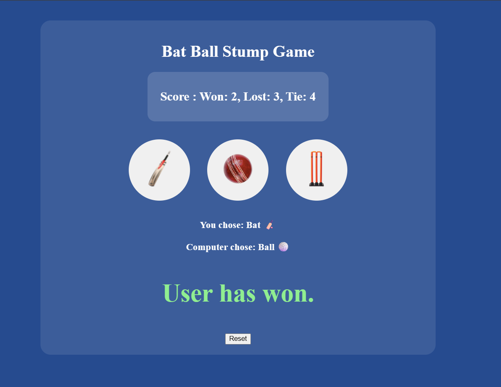

# 🏏 Bat Ball Stump Game

A simple and interactive JavaScript game inspired by the classic Rock-Paper-Scissors concept.

## 🎮 Live Demo

Play the game by selecting one of the three choices:

* 🏏 Bat
* 🏐 Ball
* 🥅 Stump

The computer randomly selects a move, and the winner is determined based on the game rules.

---

## ✨ Features

* Interactive Gameplay
* Dynamic Result Display
* Color-Coded Win/Loss/Tie Messages
* Hover Animations
* Persistent Score Tracking using Local Storage
* Reset Score Functionality
* Responsive and Clean UI

---

## 🛠️ Technologies Used

* HTML5
* CSS3
* JavaScript (ES6)

---

## 📂 Project Structure

```text
bat-ball-stump-game
│
├── cricket.html
├── cricket.css
├── cricket.js
└── images
    ├── bat.png
    ├── ball.png
    ├── stump.png
    └── game-display.png
```

---

## 📸 Game Preview



---

## 🚀 How to Run

### Option 1: Play Online

Open the live demo in your browser:

https://pragati-003.github.io/bat-ball-stump-game/

### Option 2: Run Locally

1. Clone the repository:

```bash
git clone https://github.com/pragati-003/bat-ball-stump-game.git

## 👩‍💻 Author

Pragati

Built as a JavaScript mini project to practice DOM manipulation, event handling, and local storage.
